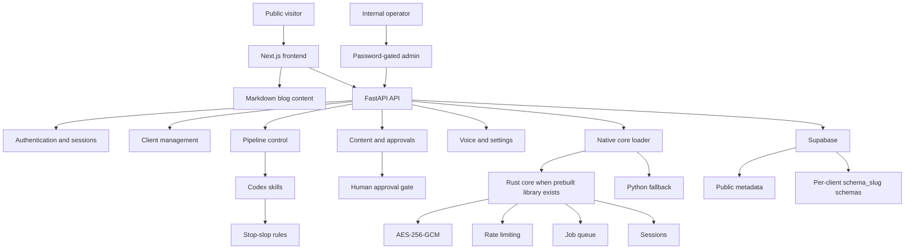

# Project Graph

```mermaid
flowchart TD
    Visitor[Public visitor] --> Frontend[Next.js frontend]
    Operator[Internal operator] --> Admin[Password-gated admin]
    Frontend --> Blog[Markdown blog content]
    Admin --> Api[FastAPI API]
    Frontend --> Api
    Api --> Auth[Authentication and sessions]
    Api --> Clients[Client management]
    Api --> Pipeline[Pipeline control]
    Api --> Content[Content and approvals]
    Api --> Voice[Voice and settings]
    Api --> Native[Native core loader]
    Native --> Rust[Rust core when prebuilt library exists]
    Native --> Python[Python fallback]
    Rust --> Crypto[AES-256-GCM]
    Rust --> Rate[Rate limiting]
    Rust --> Jobs[Job queue]
    Rust --> Sessions[Sessions]
    Api --> Supabase[Supabase]
    Supabase --> Public[Public metadata]
    Supabase --> Schemas[Per-client schema_slug schemas]
    Pipeline --> Skills[Codex skills]
    Skills --> StopSlop[Stop-slop rules]
    Content --> Approval[Human approval gate]
```

`opensrc` is used as a dependency-source inspection tool. It is not the project graph generator.
